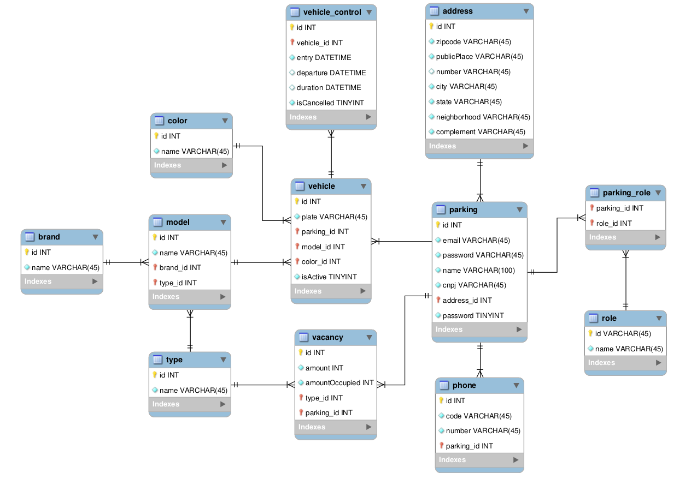

# Backend Test Java
API para o projeto desafio do Grupo FCamara. O desafio consiste na criação de um sistema para controle de veículos
em um estacionamento.

# Modelo de Entidade Relacionamento
As entidades para o banco de dados relacional foi baseada no modelo abaixo. Esse modelo foi
pensado para o desenvolvimento de um sistema que pudesse ser "adaptável" para qualquer tipo de estacionamento, uma vez que,
as entidades são flexíveis para cada usuário(estacionamento).



## Tecnologias utilizadas
- MySQL
- Java 8
- Spring Framework
  - Spring Security
    - Autenticação(JWT)
  - Spring Data
    - Hibernate
  - Spring Validation
    - Bean Validation
  - Spring Fox
    - Documentação Swagger

## Pré-requisitos
Antes de começar, você vai precisar ter instalado em sua máquina as seguintes ferramentas:
[Git](https://git-scm.com), [JDK-18](https://www.oracle.com/br/java/technologies/javase-jdk8-downloads.html) e [Maven](https://maven.apache.org/download.cgi).
Além disto é bom ter um editor para trabalhar com o código como [VSCode](https://code.visualstudio.com/)

## Rodando a Aplicação na sua máquina
- Clone este repositório através do terminal ``` $ git clone https://github.com/marcelomsilva/backend-test-java.git ```
- Acesse a pasta do projeto no terminal ``` $ cd api ```
- Faça o build e rode a API ``` $ mvn install ```
- Entre no diretório target ``` $ cd target/ ```
- Execute o comando para rodar a aplicação ``` $ java -jar <arquivo.jar com a versao atual> ```
- A Aplicação irá subir na seguinte URL:  [http://localhost:8080/](http://localhost:8080/)